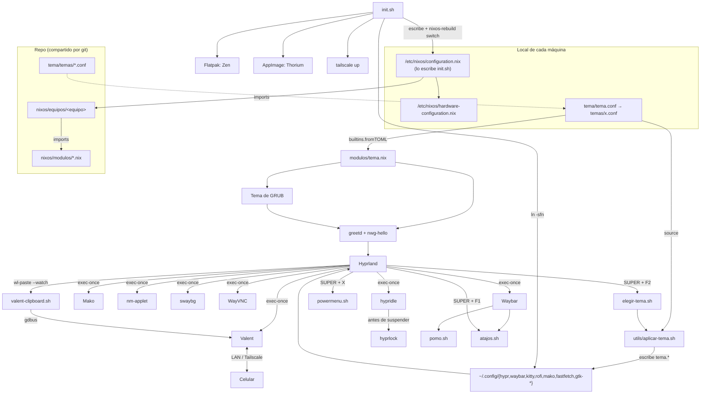

# Arquitectura del Sistema

## Descripción General

Repositorio de **dotfiles personales** para un escritorio **NixOS + Hyprland** (Wayland) en varias máquinas. Existe para reconstruir el mismo entorno en cualquier PC con un solo comando (`./init.sh`) y para que los cambios hechos en una máquina lleguen a las demás con `git pull` (`dotfiles-actualizar`).

- **Alcance**: sistema operativo (paquetes, servicios, firewall, usuarios), sesión gráfica (compositor, barra, lanzador, terminal, temas), utilidades propias (Pomodoro, menú de apagado, selector de temas, puente de portapapeles con el celular) y acceso remoto.
- **Fuera de alcance**: no hay aplicación, API ni base de datos. No se usa Home Manager ni flakes (aunque `flakes` está habilitado en Nix).
- **Equipos**: `pc-asus` (CPU AMD, disco NVMe, ext4, GRUB EFI, usuario `nova`) y `pc-admision-jorge` (CPU Intel, disco NVMe, ext4, systemd-boot, usuario `admision`). La laptop se añadirá como otro equipo. El usuario lo elige cada equipo con `dotfiles.usuario` (por defecto `nova`). Remoto: `github.com/Giovanni1906/dotfiles-nixos`.

## Stack Tecnológico

| Capa | Tecnología |
| --- | --- |
| Sistema operativo | NixOS 26.05, canal estable, sin flakes, `allowUnfree = true` |
| Arranque | GRUB con tema propio generado por Nix (`nixos/modulos/tema.nix`), arranque silencioso (`quiet`) |
| Login | `greetd` + `nwg-hello` (GTK) dentro de un Hyprland mínimo con el fondo desenfocado → lanza `start-hyprland` |
| Compositor | Hyprland 0.55 (layout `dwindle`, sintaxis nueva de `windowrule … match:class`) |
| Barra | Waybar (JSONC + CSS) con módulos `custom/*` en Bash |
| Lanzador / menús | Rofi 2.0 (`drun`, y `dmenu` para apagado, atajos y temas) |
| Terminal | Kitty (layouts `splits` y `stack`) |
| Notificaciones | Mako + `libnotify` (`notify-send`) + `paplay` para sonidos |
| Bloqueo de pantalla | `hyprlock` (`programs.hyprlock`, con su PAM) con el diseño del login; `hypridle` lo abre antes de suspender |
| Temas | Presets en `tema/temas/*.conf`; GTK `dotfiles-tema` (`adw-gtk3-dark` con la paleta del tema; `Adwaita-dark` en GTK2), iconos `dotfiles-iconos` (`Papirus-Dark` con las carpetas del color del tema), cursor Catppuccin del color de cada tema (`catppuccin-mocha-<color>-cursors`, 24 px), fuentes `JetBrainsMono Nerd Font` + `font-awesome` |
| Archivos | Thunar + `thunar-archive-plugin`, `thunar-volman`, `tumbler`, `gvfs` |
| Audio | PipeWire (ALSA + Pulse), `pwvucontrol` (clic en el volumen de Waybar) |
| Celular | Valent (implementación GTK de KDE Connect), puertos 1714–1764 TCP/UDP |
| Acceso remoto | Tailscale (VPN), WayVNC solo en la IP de Tailscale (`:5900`, cliente AVNC en el celular), Remmina (cliente) |
| Desarrollo | Docker, libvirtd/virt-manager (QEMU + swtpm), VS Code, Cursor, Postman, Navicat, FileZilla |
| Juegos | Steam, Heroic, Lutris, ProtonUp-Qt (módulo opcional por equipo) |
| Apps fuera de nixpkgs | Flatpak (Zen Browser, desde Flathub) y AppImage (Thorium, vía `appimage-run`) |

## Estructura del Repositorio

```
dotfiles/
├── init.sh                      # Instala y actualiza por pasos: usuario, sistema, apps, red, actualizar, nuevo-equipo
├── .env.example                 # Plantilla de secretos (PASS_SWAYLOCK)
├── nixos/
│   ├── modulos/                 # Configuración de sistema por función (compartida)
│   │   ├── base.nix             # Nix, idioma, red, audio, usuario, CLI, aliases; opciones dotfiles.equipo y dotfiles.usuario
│   │   ├── escritorio.nix       # Hyprland, hyprlock, portales, fuentes, apps gráficas, cursor e iconos
│   │   ├── tema.nix             # GRUB, login greetd/nwg-hello y cursor, leídos del tema activo
│   │   ├── desarrollo.nix       # Docker, Kubernetes local (Kind, Skaffold, dominios en /etc/hosts), virtualización, editores y clientes de BD/API
│   │   ├── remoto.nix           # Tailscale, Valent, WayVNC, Remmina y sus puertos
│   │   └── juegos.nix           # Steam, Heroic, Lutris
│   └── equipos/                 # Una carpeta por máquina (sin hardware)
│       ├── pc-asus/default.nix  # Módulos que usa, hostname, cargador de arranque, stateVersion
│       ├── pc-admision-jorge/default.nix  # Igual, con usuario admision, systemd-boot y aliases de admisión
│       └── plantilla/default.nix  # Base que copia `init.sh nuevo-equipo`
├── tema/
│   ├── temas/*.conf             # Temas completos: nova (por defecto), carmesi, violeta, noche, neon, relampago
│   └── tema.conf                # LOCAL (gitignored): symlink al tema elegido en esta máquina
├── config/                      # Se enlaza a ~/.config/<app>
│   ├── hypr/{hyprland.conf,hyprlock.conf,hypridle.conf}
│   ├── hypr/local.conf          # LOCAL: monitores, touchpad y ajustes de esta máquina
│   ├── waybar/{config,style.css,scripts/{pomo.sh,powermenu.sh}}
│   ├── kitty/kitty.conf
│   ├── rofi/{config.rasi,themes/nova.rasi}
│   ├── fastfetch/config.jsonc
│   ├── gtk-3.0/, gtk-4.0/, gtkrc-2.0   # Escritos originalmente por nwg-look; aplicar-tema.sh ajusta tema, iconos y cursor
│   └── */tema.*, mako/config, gtk-4.0/gtk.css, fastfetch/logo.png   # GENERADOS (gitignored) por utils/aplicar-tema.sh
├── applications/thorium.desktop # Acceso directo para Rofi drun
├── utils/
│   ├── aplicar-tema.sh          # Genera los tema.* y recarga el escritorio (alias tema-aplicar)
│   ├── elegir-tema.sh           # Selector Rofi con vista previa (SUPER + F2)
│   ├── atajos.sh + atajos.txt   # Lista única de atajos (SUPER + F1)
│   ├── wayvnc-tailscale.sh      # WayVNC solo en la IP de Tailscale (al iniciar sesión, alias remote-conexion)
│   └── kitty-zoom.sh, valent-clipboard.sh, reset-trial-navicat.sh
└── public/                      # Fondos de pantalla y PNG para el logo de fastfetch (uno por color de tema)
```

## Diagrama de Componentes



## Capas y responsabilidades

- **Módulos de sistema (`nixos/modulos/`)**: única fuente de verdad de paquetes, servicios, firewall y aliases, agrupados por función. Cada módulo añade sus grupos al usuario del equipo, `config.dotfiles.usuario` (las listas de Nix se fusionan).
- **Equipos (`nixos/equipos/<equipo>/`)**: deciden qué módulos usa cada máquina y lo que es propio de ella (hostname, cargador de arranque, `stateVersion`, paquetes sueltos). No contienen hardware.
- **Capa local de cada máquina**: `/etc/nixos/configuration.nix` (solo importa el hardware local y el equipo), `hardware-configuration.nix`, `tema/tema.conf`, `config/hypr/local.conf` y `.env`. `init.sh` los crea; ninguno se versiona.
- **Capa de sesión (`config/hypr/hyprland.conf`)**: orquesta el escritorio. Arranca servicios de usuario con `exec-once`, fija preferencias de tema vía `dconf`/`gsettings`, define atajos (`SUPER` como modificador) y reglas de ventanas flotantes. Al final incluye `local.conf`.
- **Capa de presentación (Waybar, Rofi, Kitty, GTK)**: archivos de configuración puros que usan las variables del tema; Waybar delega lógica a scripts Bash que devuelven JSON (`return-type: json`).
- **Utilidades (`config/waybar/scripts/`, `utils/`)**: scripts Bash sin dependencias más allá de los paquetes del sistema. Estado efímero en `/tmp` (Pomodoro) y vistas previas de temas en `~/.cache/dotfiles/temas`.
- **Secretos (`.env`)**: archivo local (`chmod 600`) con `PASS_SWAYLOCK`, consumido por comandos remotos de Valent para desbloquear la pantalla con `wtype`.

## Patrones Arquitectónicos

- **Módulos por función + equipos**: lo común se escribe una vez en `nixos/modulos/`; cada equipo elige qué módulos importa. Quitar algo de una máquina es comentar una línea de `imports` (ver ADR-019).
- **Hardware fuera del repo**: el `hardware-configuration.nix` de cada máquina queda en `/etc/nixos`, así una configuración nunca arranca con los UUID de discos de otra PC.
- **Sistema declarativo + usuario imperativo**: NixOS gestiona lo que requiere root; la configuración de usuario se enlaza con `ln -sfn` para que editar el repo tenga efecto sin reconstruir.
- **Scripts como "módulos" de Waybar**: contrato JSON `{text, tooltip, class}`; el estilo reacciona a `class` en `style.css`.
- **Tema centralizado con presets**: cada `tema/temas/*.conf` define colores, transparencias, radio, borde, fuente, fondo, cursor, iconos y logo de fastfetch. `tema/tema.conf` apunta al elegido; `utils/aplicar-tema.sh` lo traduce al formato de cada app (archivos `tema.*` que las configs incluyen con `source`, `@import` o `include`) y `nixos/modulos/tema.nix` lo lee con `builtins.fromTOML`. Los archivos generados no se versionan (ver ADR-020). Para GTK (Thunar y demás) genera fuera del repo el tema `~/.local/share/themes/dotfiles-tema`, que importa `adw-gtk3-dark` y redefine sus colores (ver ADR-023), y el tema de iconos `~/.local/share/icons/dotfiles-iconos` con las carpetas del color del tema (ver ADR-024).
- **Sin servicios propios**: no hay systemd units de usuario definidas en el repo; todo arranca desde `exec-once`.

## Configuración que NO está en el repo

Además de la capa local descrita arriba: `~/.config/wayvnc` (sin autenticación configurada), configuración de Valent (emparejamiento y comandos remotos), `~/.gtkrc-2.0.mine`. Los respaldos de `init.sh` quedan en `~/.local/state/dotfiles/respaldo/` y `/etc/nixos/*.respaldo-<fecha>`.
