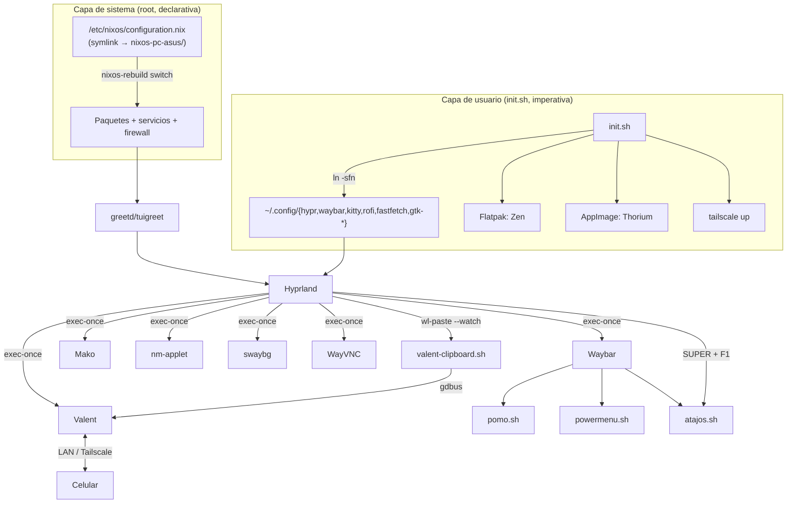

# Arquitectura del Sistema

## Descripción General

Repositorio de **dotfiles personales** para un escritorio **NixOS + Hyprland** (Wayland). Existe para poder reconstruir el mismo entorno de trabajo en cualquier PC con dos pasos: aplicar la configuración declarativa de NixOS y ejecutar `init.sh`, que enlaza las configuraciones de usuario.

- **Alcance**: sistema operativo (paquetes, servicios, firewall, usuarios), sesión gráfica (compositor, barra, lanzador, terminal, temas), utilidades propias (Pomodoro, menú de apagado, puente de portapapeles con el celular) y acceso remoto.
- **Fuera de alcance**: no hay aplicación, API ni base de datos. No se usa Home Manager ni flakes (aunque `flakes` está habilitado en Nix).
- **Equipo actual**: `nixos-pc-asus` (CPU AMD, disco NVMe, ext4, systemd-boot). Usuario `nova`. Remoto: `github.com/Giovanni1906/dotfiles-nixos`.

## Stack Tecnológico

| Capa | Tecnología |
| --- | --- |
| Sistema operativo | NixOS 26.05 (`system.stateVersion = "26.05"`), canal estable, `allowUnfree = true` |
| Login | `greetd` + `tuigreet` → lanza `start-hyprland` |
| Compositor | Hyprland 0.55 (layout `dwindle`, sintaxis nueva de `windowrule … match:class`) |
| Barra | Waybar (JSONC + CSS) con módulos `custom/*` en Bash |
| Lanzador / menús | Rofi 2.0 (`drun` y `dmenu` para el menú de apagado) |
| Terminal | Kitty (layouts `splits` y `stack`) |
| Notificaciones | Mako + `libnotify` (`notify-send`) + `paplay` para sonidos |
| Bloqueo de pantalla | `swaylock-effects` (PAM habilitado en `security.pam.services.swaylock`) |
| Temas | GTK `Adwaita-dark`, cursor `catppuccin-mocha-sky-cursors` (24 px), fuentes `JetBrainsMono Nerd Font` + `font-awesome` |
| Archivos | Thunar + `thunar-archive-plugin`, `thunar-volman`, `tumbler`, `gvfs` |
| Audio | PipeWire (ALSA + Pulse), `pulsemixer` |
| Celular | Valent (implementación GTK de KDE Connect), puertos 1714–1764 TCP/UDP |
| Acceso remoto | Tailscale (VPN), WayVNC en `0.0.0.0:5900`, Remmina (cliente) |
| Desarrollo | Docker, libvirtd/virt-manager (QEMU + swtpm), VS Code, Cursor, Postman, Navicat, FileZilla |
| Apps fuera de nixpkgs | Flatpak (Zen Browser, desde Flathub) y AppImage (Thorium, vía `appimage-run`) |

## Estructura del Repositorio

```
dotfiles/
├── init.sh                      # Instalador de la capa de usuario (symlinks, flatpak, appimage, tailscale)
├── .env.example                 # Plantilla de secretos (PASS_SWAYLOCK)
├── nixos-pc-asus/               # Configuración de sistema de UN equipo concreto
│   ├── configuration.nix        # Paquetes, servicios, firewall, aliases, usuario
│   └── hardware-configuration.nix  # Generado por nixos-generate-config (UUIDs de discos)
├── config/                      # Se enlaza a ~/.config/<app>
│   ├── hypr/hyprland.conf       # Autoarranque, atajos, reglas de ventanas
│   ├── waybar/{config,style.css,scripts/{pomo.sh,powermenu.sh}}
│   ├── kitty/kitty.conf
│   ├── rofi/{config.rasi,themes/material.rasi}
│   ├── fastfetch/config.jsonc
│   ├── gtk-3.0/, gtk-4.0/, gtkrc-2.0   # Escritos originalmente por nwg-look
├── icons/                       # Se enlaza a ~/.local/share/icons/icons
│   ├── default/index.theme      # Hereda el cursor Catppuccin
│   └── catppuccin-mocha-sky-cursors -> /run/current-system/sw/share/icons/...  (symlink versionado)
├── applications/thorium.desktop # Acceso directo para Rofi drun
├── utils/                       # Scripts sueltos (valent-clipboard.sh, reset-trial-navicat.sh, kitty-zoom.sh, atajos.sh)
│   └── atajos.txt               # Lista única de atajos que muestra SUPER + F1
└── public/                      # Fondos de pantalla y PNG para el logo de fastfetch
```

## Diagrama de Componentes



## Capas y responsabilidades

- **Capa de sistema (`nixos-pc-asus/`)**: única fuente de verdad de paquetes, servicios, usuarios, grupos (`networkmanager wheel docker input libvirtd kvm`), firewall y aliases de shell. Se aplica con `nix-switch`. En este equipo `/etc/nixos/configuration.nix` y `hardware-configuration.nix` son **symlinks** a esta carpeta.
- **Capa de sesión (`config/hypr/hyprland.conf`)**: orquesta el escritorio. Arranca servicios de usuario con `exec-once`, fija preferencias de tema vía `dconf`/`gsettings`, define atajos (`SUPER` como modificador) y reglas de ventanas flotantes (`pomo-mixer`).
- **Capa de presentación (Waybar, Rofi, Kitty, GTK)**: archivos de configuración puros; Waybar delega lógica a scripts Bash que devuelven JSON (`return-type: json`).
- **Utilidades (`config/waybar/scripts/`, `utils/`)**: scripts Bash sin dependencias externas más allá de los paquetes del sistema. Estado efímero en `/tmp` (`/tmp/pomo_status`, `/tmp/pomo_pid`).
- **Secretos (`.env`)**: archivo local no versionado (`chmod 600`) con `PASS_SWAYLOCK`, consumido por comandos remotos de Valent para desbloquear la pantalla con `wtype`.

## Patrones Arquitectónicos

- **Sistema declarativo + usuario imperativo**: NixOS gestiona lo que requiere root; la configuración de usuario se enlaza por symlinks (`ln -sfn`) para que editar el repo tenga efecto inmediato sin reconstruir.
- **Una carpeta por equipo** (`nixos-<equipo>/`): el hardware cambia entre máquinas, la capa `config/` es compartida. Hoy solo existe `nixos-pc-asus` (la de `nixos-laptop-hp` se eliminó el 2026-09-26).
- **Scripts como "módulos" de Waybar**: contrato JSON `{text, tooltip, class}`; el estilo reacciona a `class` en `style.css`.
- **Paleta centralizada en Waybar**: variables `@define-color` en `style.css`; `powermenu.sh` replica la misma paleta en variables Bash.
- **Sin caché, sin servicios propios**: no hay systemd units de usuario definidas en el repo; todo arranca desde `exec-once`.

## Configuración que NO está en el repo

Estas piezas usan valores por defecto o viven solo en la máquina: `~/.config/mako`, `~/.config/swaylock`, `~/.config/wayvnc` (sin autenticación configurada), configuración de Valent (emparejamiento y comandos remotos), `~/.gtkrc-2.0.mine`, `~/.bash_profile` (lo modifica `init.sh`).
